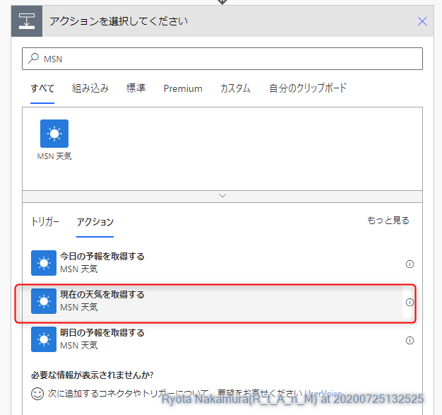

Power Automate Hands On
---

# 当ハンズオンで行うこと

当ハンズオンでは、Power Automate を使用して、スマートフォンの現在位置の天気を取得し、Twitterにツイートする処理を作成します。


このハンズオンを通じて、 Power Automate が如何に簡単に自動化できるかを体験できれば幸いです。

# 事前に必要なもの

* Power Automate をインストール可能なスマートフォン
* Twitter アカウント

# 目次

<!-- TOC -->

- [当ハンズオンで行うこと](#当ハンズオンで行うこと)
- [事前に必要なもの](#事前に必要なもの)
- [目次](#目次)
- [1. 環境準備/ログイン](#1-環境準備ログイン)
    - [1.1 Power Apps コミュニティプランの新規作成](#11-power-apps-コミュニティプランの新規作成)
    - [1.2 ログイン](#12-ログイン)
    - [スマートフォンの準備](#スマートフォンの準備)
- [2. お天気情報ツイートフロー（初級編）](#2-お天気情報ツイートフロー初級編)
    - [2-1. 環境設定](#2-1-環境設定)
    - [2-2. フロー作成](#2-2-フロー作成)
- [3. お天気情報ツイートフロー（中級編）](#3-お天気情報ツイートフロー中級編)
    - [3-1. 現在時刻の取得](#3-1-現在時刻の取得)
    - [3-2.風速の秒速化](#3-2風速の秒速化)
        - [使用している関数 の説明](#使用している関数-の説明)
- [4. お天気情報ツイートフロー（上級？編）](#4-お天気情報ツイートフロー上級編)

<!-- /TOC -->


# 1. 環境準備/ログイン

Power Automate を使用するための環境を準備します。

Microsoft 365 や Power Automate 有償プランを会社でお持ちの方はそちらを利用して頂いても構いませんが、個人で自由に利用できるためのプランとして、コミュニティプランというものがありますので、是非そちらもお使いください。<br>
有償プラン ※1 と同等の機能を無償でお使い頂けます。

※1：RPA機能（UI Flows/WinAutomation）は使用できません。

## 1.1 Power Apps コミュニティプランの新規作成

既にコミュニティプランをお持ちの方はスキップしていただいて構いません。

1. Power Apps コミュニティプラン サイトにアクセスします。

https://powerapps.microsoft.com/ja-jp/communityplan/

2. 「無料で使い始める」をクリックします。


3. サインアップをおこないます。


※gmailやhotmailなどは使用できません。

4. 会社のアカウントかどうかの確認を求められるので、「はい」をクリックします。


5. アカウント情報の生成画面に遷移するので、必要事項を記入の上、「はい」をクリックします。


以上で環境作成は完了です。

## 1.2 ログイン

1. Power Automate サインインサイトにアクセスします。

以下のリンク先をクリックする。
[Power Automate ログイン](https://flow.microsoft.com/ja-jp/signin/?redirectUrl=https%3a%2f%2fflow.microsoft.com%2fja-jp%2f)

2. 作成したアカウントを使用してサインインします。


3. 環境をクリックし、自身の名前がついた環境に切り替えます。


4. 赤枠でかこっている表示が出ていれば、コミュニティプランの環境に切り替わっています。


## スマートフォンの準備

※写真はiOS版のものですが、Androidでも基本的には同じです。

1. App Store や Google Store にて Power Automate を検索します。


2. Power Automate が表示されるので、インストールを行います。


3. 作業の開始をタップし、サインインを行います。


4. アカウントをタップします。


5. 環境をタップし、先ほど作成した環境を選択してOKをタップします。


6. もう一度アカウントをタップし、環境名が正しく変更されていることを確認します。


# 2. お天気情報ツイートフロー（初級編）

## 2-1. 環境設定

1. Power Automate の環境横にある設定ボタンをクリックします。


2. すべての Power Automate 設定を表示をクリックします。


3. 表示言語を日本語に設定し、試験的な機能をオンにして、保存します。


## 2-2. フロー作成

1. 作成をクリックします。


2. インスタントフローをクリックします。


3. 任意の名前を入力し、「手動でフローをトリガーします」を選択して作成ボタンをクリックします。


4. 新しいステップをクリックします。


5. MSN と検索し、アクションから「現在の天気を取得する」をクリックします。



6. 「現在の天気を取得する」アクションの設定画面が表示されるので、場所を選択し、動的な値を追加しますをクリックします。


7. 動的な値を以下のように設定します。


8. 単位を「Metric」に変更します。


9. 新しいステップをクリックします。


10. Twitter と検索し、アクションから「ツイートの投稿」をクリックします。


11. 初回使用時は Twitter のサインインを求められるので、サインインをクリックします。


12. ポップアップウィンドウが立ち上がりますので、Twitter認証を実施します。


13. Twitter のアカウント認証が通ると、このような表示になります。


14. ツイートテキストをクリックし、MSN天気の場所を設定したように、以下のように設定します。


|動的な値|アクション名|
|:--|:--|
|日付|手動フロー|
|条件|現在の天気|
|気圧|現在の天気|
|温度|現在の天気|
|湿度|現在の天気|
|風速|現在の天気|
|瞬間風速|現在の天気|
|紫外線指数|現在の天気|

15. フローを保存します。


16. スマートフォン側を確認すると、ボタンが出現していますので、タップします。


17. フロー画面にて戻るボタンをクリックします。


18. 実行履歴が成功していることを確認します。


19. 履歴をクリックすると、実行結果が表示されます。


20. Twitterに投稿されていることを確認します。


# 3. お天気情報ツイートフロー（中級編）

ツイート内容を見てもらえばわかりますが、投稿時間が日付だし、風速は時速でちょっとピンとこないし・・・
ということで、変換アクションや関数を使ってアレンジを加えていきたいと思います。

## 3-1. 現在時刻の取得

1. 編集ボタンをクリックします。


2. ツイート投稿の前の矢印にカーソルを合わせ、プラスをクリックします。


3. アクションの追加をクリックします。


4. タイムと検索し、アクションから「タイム ゾーンの変換」をクリックします。


5. 各種パラメータを以下のように設定します。


|パラメータ名|内容|
|:--|:--|
|基準時間|タイムスタンプ（手動フローアクション）|
|変換元のタイムゾーン|(UTC)協定世界時|
|変換先のタイムゾーン|(UTC +09:00)大阪、札幌、東京|
|書式設定文字列|世界共通の並べ替え可能な日時パターン|

6. ツイートの投稿にて投稿時間の値を変換後の時間に変更します。


## 3-2.風速の秒速化

1. ツイート投稿の前の矢印にカーソルを合わせ、プラスをクリックします。


2. アクションの追加をクリックします。


3. 数値と検索して「数値の書式設定」をクリックします。


4. 番号を選択して、「式を追加します」をクリックします。


5. Expression に以下の式を入力します。

```
mul(
    div(
        body('現在の天気を取得する')?['responses']?['weather']?['current']?['windSpd'],
        3600
    ),
    1000
)
```

### 使用している関数 の説明

風速は時速 km/h の数値となるので、秒速 m/s に変換します。<br>
まずは時速を秒速に変更するために3600で割り<br>
その後、kmからmに変換するため1000倍する必要があります。

* mul 関数：2つの数値を乗算した積を返します。
* div 関数：2つの数値を除算した結果を返します。

[Power Automate 式関数のリファレンスガイド](https://docs.microsoft.com/ja-jp/azure/logic-apps/workflow-definition-language-functions-reference)

計算式に置き換えると以下のようになります

```
(風速/3600秒)×1000
```


6. フォーマットをクリックし、「1,234.00」をクリックします。


7. アクション名右にあるメニューボタン（…）をクリックします。


8. メニューから「名前の変更」をクリックします。


9. 名称を「風速 秒速変換」と設定します。


10. 同様に、瞬間風速も変換します。

```
mul(
    div(
        body('現在の天気を取得する')?['responses']?['weather']?['current']?['windGust'],
        3600
    ),
    1000
)
```


11. ツイート内容を以下のように変更します。


12. 保存し、スマートフォン側でボタンを再度タップします。

13. きちんとツイートできていることを確認します。


# 4. お天気情報ツイートフロー（上級？編）

天気の名称が英語なのちょっと厳しいですよねー
なので、この辺を日本語訳してみましょう！

手順は特に明記していません。
ヒントはこんな感じです！


