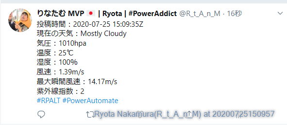
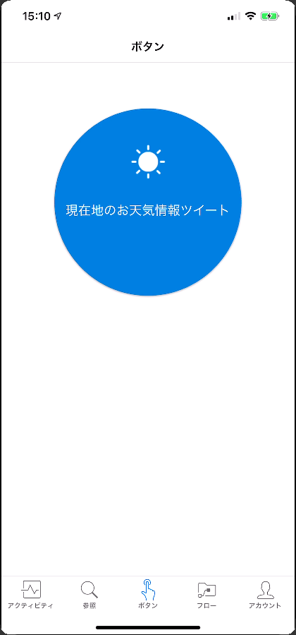

# 本資料について

こちらは、2020年7月28日に開催されました 
RPA Community Power Automate 支部のハンズオン資料になります。 

当ハンズオンでは、Power Automate を使用して、スマートフォンの現在位置の天気を取得し、Twitterにツイートする処理を作成します。

このハンズオンを通じて、 Power Automate が如何に簡単に自動化できるかを体験できれば幸いです。

[ハンズオン資料](./HandsOn.md)

本資料については、再配布可能な資料ですので、社内やコミュニティなどにぜひご活用ください。 

# LICENSE

本資料は GNU General Public License version 3 によって保護されています。 

# お問い合わせ先

本資料に関するお問い合わせは以下のリンク先に記載の連絡先までお願いいたします。 
[連絡先掲載ページ](http://bit.ly/Sentreseau_CTO_Info)