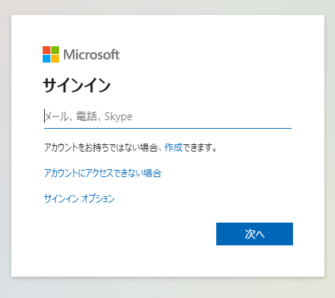
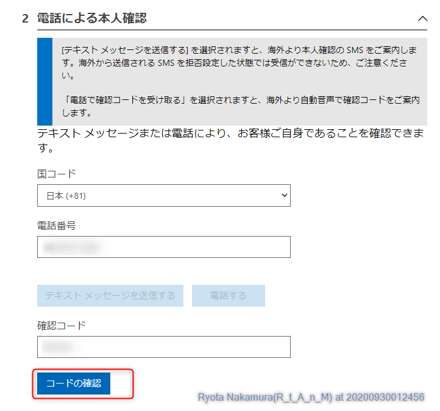
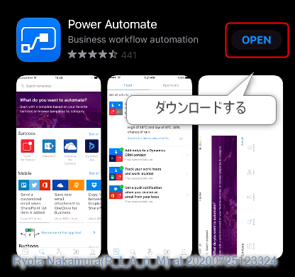
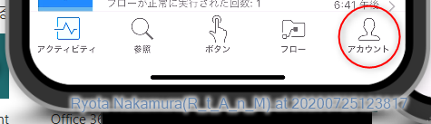
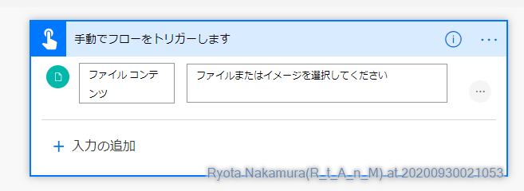
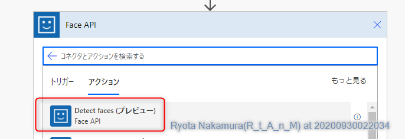
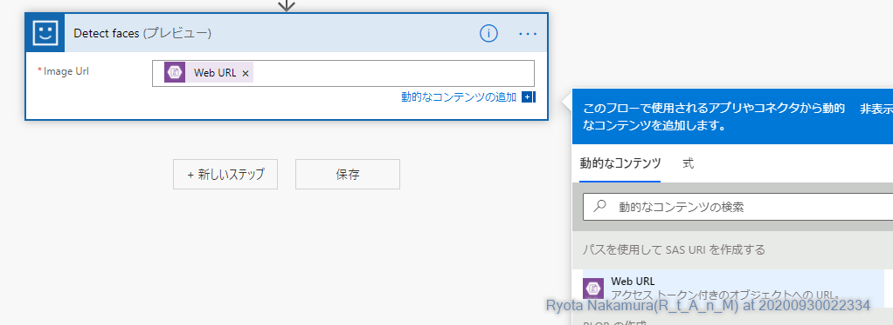

Power Automate Hands On
---

# 当ハンズオンで行うこと

当ハンズオンでは、Power Automate を使用して、撮影した写真の顔から様々な情報を取得するフローを作成しています。

# 事前に必要なもの

* Power Automate をインストール可能なスマートフォン
* Microsoft アカウント

# 1. 環境準備/ログイン

Power Automate を使用するための環境を準備します。

Microsoft 365 や Power Automate 有償プランを会社でお持ちの方はそちらを利用して頂いても構いませんが、個人で自由に利用できるためのプランとして、コミュニティプランというものがありますので、是非そちらもお使いください。 
有償プラン ※1 と同等の機能を無償でお使い頂けます。

※1：RPA機能（UI Flows/WinAutomation）は使用できません。

## 1.1 Microsoft 365 developer program への参加

* 既に Microsoft 365 アカウントをお持ちの方はこの内容をスキップしてください。

1. Microsoft 365 Developer プログラムのサイトにアクセスします。

[Microsoft 365 Developer プログラム](https://developer.microsoft.com/ja-jp/microsoft-365/dev-program)

2. 参加するをクリックします。

3. Microsoft アカウントでサインインします。

4. 国名と会社名と言語設定をそれぞれ指定し、次へをクリックします。

5. 該当するものにチェックを入れて、参加をクリックします。

6. E5 サブスクリプションのセットアップをクリックします。

7. 適宜任意のものを入れていき、続行をクリックします。

8. SMS使用可能な電話番号を入力し、コードの送信をクリックします。

9. SMSにワンタイムパスワードが送られたら、コードを入力しセットアップをクリックします。

10. サブスクリプションに移動するをクリックします。

11. 作成したアカウントのパスワードでサインインします。

12. 管理をクリックします。

13. Microsoft 365 のアカウントをクリックします。

14. ユーザーを展開し、アクティブなユーザーをクリックします。

15. アカウントを選択し、製品ライセンスの管理をクリックします。

16. ライセンスにチェックが入っていることを確認し、変更の保存をクリックします。

## 1.2 Azure 環境の準備

* 既に Azure アカウントをお持ちの方はこの内容をスキップしてください。
* 1.1 をスキップされた方は、お持ちのMicrosoft 365 アカウントを用いて予めサインインしておいてください。

1. Azure にアクセスします。

[Azure](https://azure.microsoft.com/ja-jp/)

2. Azure を無料で試すをクリックします。

3. 無料で始めるをクリックします。

4. Microsoft 365 のアカウントをクリックします。

5. プロフィールを確認し、次へをクリックします。

6. 電話による本人確認を行います

7. クレジットカードによる本人確認を行います。

※デビッドカード可

8. アグリーメントにて同意し、サインアップをクリックします。

9. サインインアカウントを選択します。

10. ポータルに移動します。

11. ホームをクリックします

12. ポータルが表示されます。

## 1.3 Power Apps Community Plan のサインアップ

* 1.1 をスキップされた方で、Microsoft 365アカウントに既にCommunity Plan の環境がある方は、スキップしてください。
* それ以外の方はMicrosoft 365 のアカウントでサインインしておいてください。

1. Power Apps コミュニティプラン サイトにアクセスします。

[Power Apps Community Plan](https://powerapps.microsoft.com/ja-jp/communityplan/)

2. 個人環境の作成をクリックします。

3. Microsoft 365 アカウントを選択します。

4. 国名を選択して、同意するをクリックします。

5. 環境をクリックして、default 環境以外が表示されていることを確認してください。

## 1.4 Power Automate アプリのインストール

* 既にスマートフォンにPower Automate がインストールされている方は1及び2をスキップしてください。

※写真はiOS版のものですが、Androidでも基本的には同じです。

1. App Store や Google Store にて Power Automate を検索します。

2. Power Automate が表示されるので、インストールを行います。

3. 作業の開始をタップし、サインインを行います。

4. アカウントをタップします。

5. 環境をタップし、先ほど作成した環境を選択してOKをタップします。

6. もう一度アカウントをタップし、環境名が正しく変更されていることを確認します。

# 2. Azure側の準備

## 2.1. リソースグループの作成

1. リソースグループをクリックします。

2. 「追加」をクリックします。

3. リソースグループのパラメータを指定します。

4. 作成をクリックします。

## 2.2. ストレージアカウントの作成

1. 作成したリソースグループから「追加」をクリックします。

2. ストレージアカウントを選択します。

3. ストレージアカウントのパラメータを指定します。

4. 作成をクリックします。

## 2.3. Face APIの作成

1. 作成したリソースグループから「追加」をクリックします。

2. Faceを選択します。

3. 作成をクリックします。

4. Faceのパラメータを指定します。

## 2.4 各種リソースの準備

1. 作成済みのストレージアカウントを開きます。

2. コンテナーを開きます。

3. コンテナーを作成します。

4. ストレージアカウントのアクセスキーを取得します。

5. 作成済みのFace APIを開き、アクセスキーを取得します。

# 3.Power Automate の作成

1. Power Automate を起動します。

2. 環境をコミュニティプランに切り替えます。

3. 開発者環境である旨の通知が表示されていることを確認します。

4. マイフローをクリックします。

5. インスタントから作成をクリックします。

6. 任意の名称を入力し、手動でフローをトリガーしますを選択して作成をクリックします。

7. 手動でフローをトリガーしますを選択し、入力の追加からファイルをクリックします。

8. 新しいステップをクリックし、Azure Blob Storage から Blobの作成をクリックします。

9. 無料体験をクリックします

10. ストレージアカウントの接続情報を登録します。

11. フォルダーのパスにコンテナ名を入力し、ファイル名は任意のもの、Blobコンテンツにトリガーのファイルコンテンツを指定します。

12. 新しいステップをクリックし、Azure Blob Storage から、パスを使用してSAS URIを作成するをクリックします。

13. BLOBパスにBlobの作成からPathを指定します。

14. 新しいステップをクリックし、Face APIからDetect faces をクリックします。

15. Face API の接続情報を登録します。

16. Image Url に パスを使用してSAS URIを作成するの WebURLを指定します。

17. 戻り値を通知したり、Twitterに上げてみるなどしてみてください！

